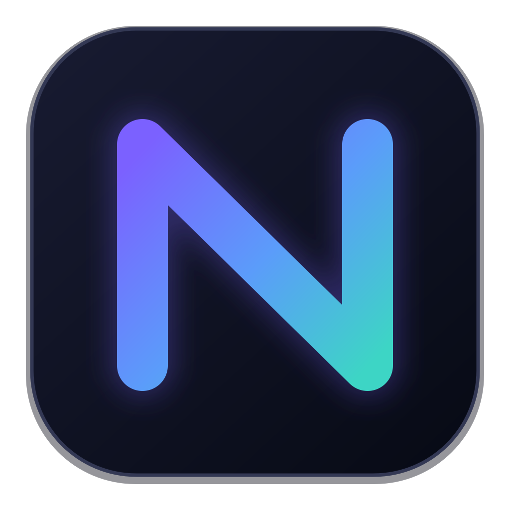
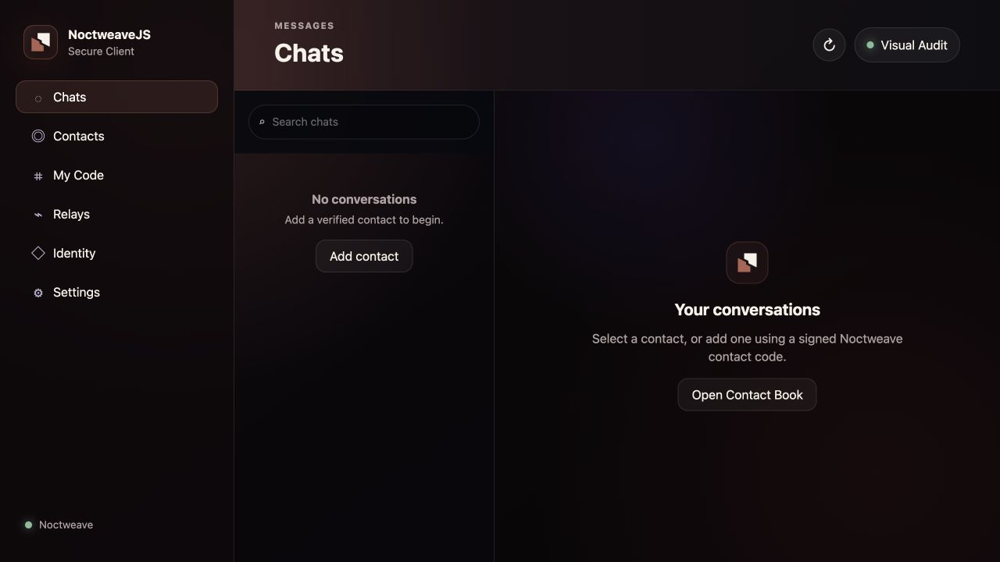
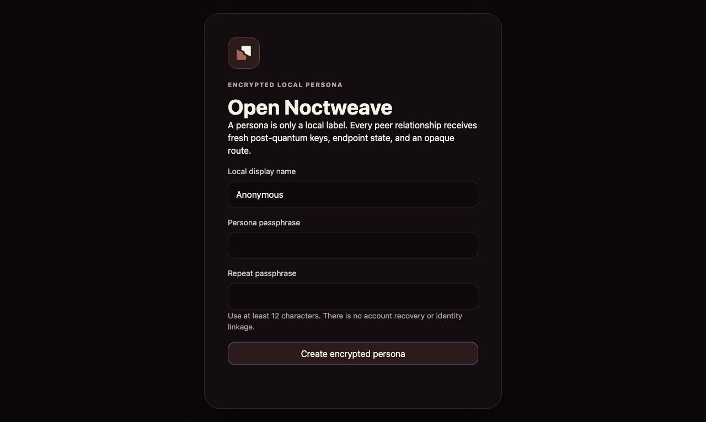

<p align="center">
  
</p>

<a id="noctweavejs"></a>

<h1 align="center">NoctweaveJS</h1>

<p align="center"><strong>Encrypted messaging primitives for browser, Node, and desktop hosts.</strong></p>

<p align="center">
  <a href="#overview">Overview</a> ·
  <a href="#quick-start">Quick start</a> ·
  <a href="#features">Features</a> ·
  <a href="#security-and-privacy">Security</a> ·
  <a href="#documentation">Documentation</a>
</p>

## Overview

NoctweaveJS implements the Noctweave 1.0 protocol base in JavaScript. It
combines bounded relay access, post-quantum contact establishment, encrypted
local storage, and a browser client with an optional Electrobun desktop host.
Each relationship receives fresh cryptographic material; personas remain local
labels.

| Detail | At a glance |
| --- | --- |
| Platform | Browser · Node.js · Electrobun desktop |
| Built with | JavaScript · WebCrypto · liboqs WASM |
| License | [Apache-2.0; helper licenses apply](LICENSE) |

> **Status:** Protocol candidate. Call primitives are experimental; browser storage and desktop host guarantees differ.

<a id="clone-and-verify"></a>

## Quick start

Requires Node.js 20+ and Bun 1.3+. Run the browser client from a source checkout:

```sh
git clone https://github.com/luizwidmer/NoctweaveJS.git
cd NoctweaveJS
bun install --frozen-lockfile
npm run dev:client
```

Open the local address printed by the development server. Choose an explicit
storage profile, check a relay you control, and create an encrypted local
persona. For the desktop wrapper, use `bun run desktop:dev`; hardware-key
support also requires the [native helper setup](INTEGRATION_GUIDE.md#hardware-security-key-unlock).

`bun.lock` is the reproducible dependency source used by CI. An `npm install`
checkout is a development alternative.

<a id="screenshots"></a>

<a id="client-workspace"></a>

<a id="encrypted-persona-setup"></a>

## Features

| Surface | What it provides |
| --- | --- |
| Relay client | Exact HTTP/WebSocket envelopes, bounded responses, and capability discovery. |
| Pairwise messaging | Fresh relationship authority, encrypted events, durable retry, and cursor sync. |
| Encrypted storage | Wrappers for local stores, a separately managed key, and explicit host authority. |
| Client workspace | Persona setup, pairing, conversations, and local vault controls. |
| Noctweb site data | Bounded origin-scoped document operations for hosted sites. |
| Experimental calls | ML-KEM call setup and encrypted frames for an application-supplied media transport. |



<details>
<summary>View encrypted persona setup</summary>



</details>

<a id="transport-and-security-boundaries"></a>

## Security and privacy

The first-run workspace requires an explicit storage/security profile
acknowledgment, a relay connectivity check, and then creates the encrypted
local persona. Plain browsers use an authenticated atomic IndexedDB anchor as a
best-effort, rollbackable profile; ordinary browser storage has no hardware
rollback resistance and is not equivalent to the hardened Electrobun host
anchor. There is no silent storage fallback.

Electrobun uses durable host anchors backed by macOS Keychain, Linux Secret
Service, or Windows Credential Manager. If the platform backend is unavailable,
onboarding exposes the limitation and keeps persona creation disabled.

- Browser clients support explicit HTTP(S) and WebSocket(S) relay endpoints.
- Raw TCP endpoints fail explicitly in the browser client.
- Request and response byte ceilings are enforced before unbounded allocation.
- HTTP redirects, ambient credentials, referrers, and caching are disabled.
- Relay errors are classified without echoing response bodies or bearer data.
- Opaque route authority proofs are verified locally before submission.
- Route responses are exact-field decoded and bound to the initiating request.
- Endpoint manifests advertise exact module and application-content major-version
  capabilities; two-field manifests without `contentTypes` are invalid.
- Direct-v4 authenticates the shared content families in its session transcript
  and refuses outbound application or receipt types the peer did not advertise.
- Signed-prekey freshness gates only a new bootstrap at its authenticated send
  time. Established sessions remain valid after prekey expiry, and bounded
  retired private prekeys admit delayed pre-expiry bootstraps within the receive
  retention window.
- Relationship route updates, targeted route probes, and endpoint-prekey updates
  use independently signed, relationship-scoped control frames.
- Unknown application content may be retained. Unknown authenticated controls are
  quarantined, and malformed known controls fail closed without mutating state.

Noctweave relays route and retain ciphertext. They are not plaintext processors,
key escrow services, identity providers, or required notification providers.

## Development

```sh
npm test
npm run typecheck:desktop
```

The checked-in liboqs WASM artifact is the reference post-quantum runtime. To
rebuild it, provide Emscripten 6.0.1 and a liboqs checkout at the pinned commit,
then run:

```sh
git clone https://github.com/open-quantum-safe/liboqs.git vendor/liboqs
git -C vendor/liboqs checkout 5a1a854b0dc9f2141bdc771c555ee60c37950183
npm run build:oqs-wasm
```

Set `NOCTWEAVE_LIBOQS_DIR` when the pinned liboqs checkout lives elsewhere.

<a id="related-repositories"></a>

## Documentation

| Read | For |
| --- | --- |
| [Hardware security-key unlock](INTEGRATION_GUIDE.md#hardware-security-key-unlock) | Integration requirements and worked examples |
| [Experimental calls](INTEGRATION_GUIDE.md#experimental-calls) | Integration requirements and worked examples |
| [Relay client](INTEGRATION_GUIDE.md#relay-client) | Integration requirements and worked examples |
| [Noctweb site data](INTEGRATION_GUIDE.md#noctweb-site-data) | Integration requirements and worked examples |
| [Pairwise contact establishment](INTEGRATION_GUIDE.md#pairwise-contact-establishment) | Integration requirements and worked examples |
| [Durable pairwise messaging](INTEGRATION_GUIDE.md#durable-pairwise-messaging) | Integration requirements and worked examples |
| [Storage](INTEGRATION_GUIDE.md#storage) | Integration requirements and worked examples |

- [Noctweave](https://github.com/luizwidmer/Noctweave) — protocol specification, Swift core, CLI, and relay server
- [Noctweave protocol documentation](https://github.com/luizwidmer/Noctweave/tree/main/NoctweaveDocumentation)

<details>
<summary>Links from earlier README versions</summary>

<a id="hardware-security-key-unlock"></a>

**Hardware security-key unlock:** [Open the integration guide](INTEGRATION_GUIDE.md#hardware-security-key-unlock).

<a id="experimental-calls"></a>

**Experimental calls:** [Open the integration guide](INTEGRATION_GUIDE.md#experimental-calls).

<a id="relay-client"></a>

**Relay client:** [Open the integration guide](INTEGRATION_GUIDE.md#relay-client).

<a id="noctweb-site-data"></a>

**Noctweb site data:** [Open the integration guide](INTEGRATION_GUIDE.md#noctweb-site-data).

<a id="pairwise-contact-establishment"></a>

**Pairwise contact establishment:** [Open the integration guide](INTEGRATION_GUIDE.md#pairwise-contact-establishment).

<a id="durable-pairwise-messaging"></a>

**Durable pairwise messaging:** [Open the integration guide](INTEGRATION_GUIDE.md#durable-pairwise-messaging).

<a id="storage"></a>

**Storage:** [Open the integration guide](INTEGRATION_GUIDE.md#storage).

</details>

## License

The main project is licensed under Apache-2.0. Browser examples under
`examples/` are MIT licensed. Shared protocol test vectors under
`test/fixtures/protocol/` retain their CC-BY-SA-4.0 notice. See the nearest
`LICENSE` file and [NOTICE](NOTICE).
